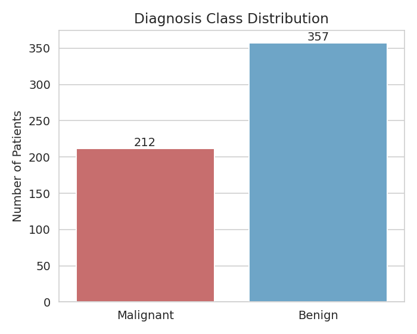
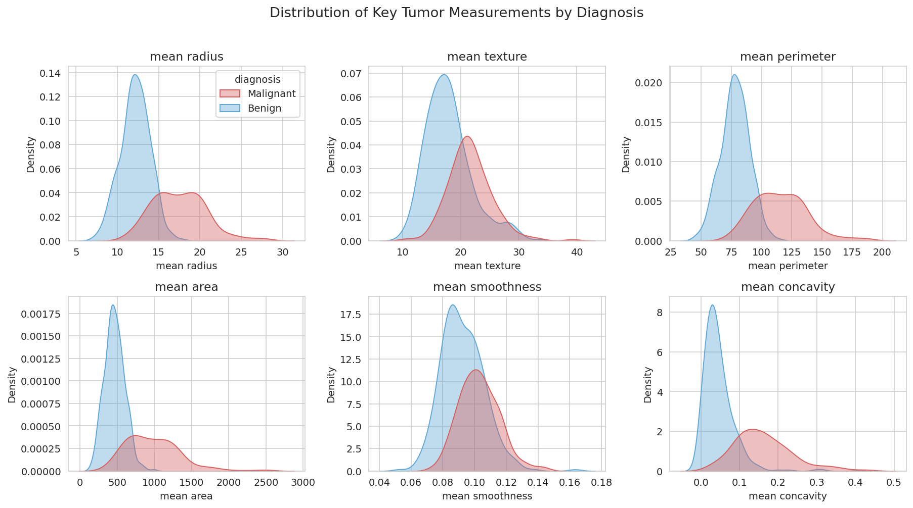
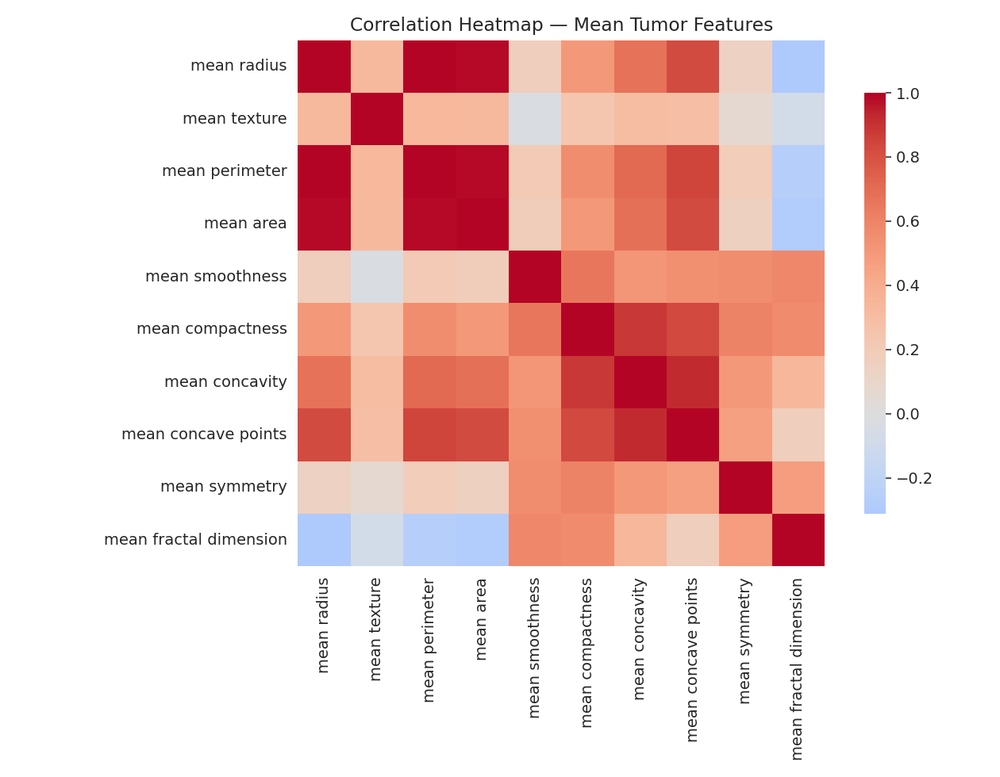
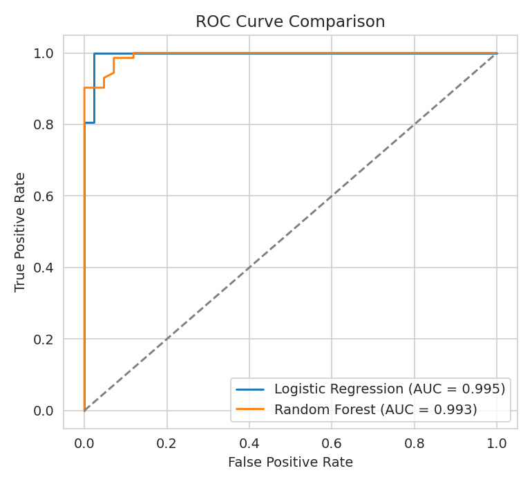
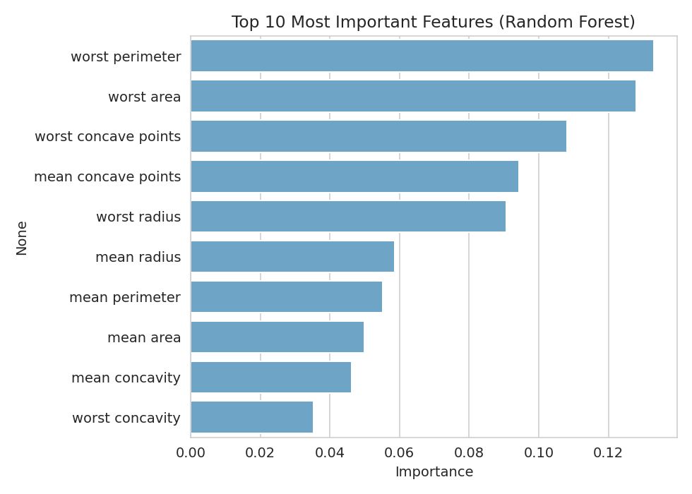

# Breast Cancer Diagnosis Prediction — Health Data Project

A real-world, end-to-end data science project applying classification models to
predict whether a breast tumor is **malignant** or **benign** based on diagnostic
measurements from patient biopsy samples.

## Dataset

**Breast Cancer Wisconsin (Diagnostic) Dataset** — 569 real patient records, each
with 30 numeric features (radius, texture, perimeter, area, smoothness, concavity,
etc.) computed from digitized images of fine needle aspirate (FNA) biopsies.

- 357 benign cases
- 212 malignant cases

File: [`patient_records.csv`](patient_records.csv)

## Project Workflow

1. **Exploratory Data Analysis** — class balance, feature distributions, correlation structure
2. **Modeling** — Logistic Regression and Random Forest classifiers, trained on an 80/20 train/test split with standardized features
3. **Evaluation** — accuracy, precision, recall, F1, ROC-AUC, 5-fold cross-validation
4. **Conclusions** — feature importance and clinical interpretation

## Results

| Model | Accuracy | Precision | Recall | F1-Score | ROC-AUC | CV Mean Acc. |
|---|---|---|---|---|---|---|
| Logistic Regression | 0.982 | 0.986 | 0.986 | 0.986 | 0.995 | 0.980 |
| Random Forest | 0.956 | 0.959 | 0.972 | 0.966 | 0.993 | 0.960 |

Logistic Regression slightly outperformed Random Forest, suggesting the relationship
between these diagnostic measurements and malignancy is largely linear and well-separated.

### Key Visuals

**Class distribution**



**Feature distributions by diagnosis**



**Correlation heatmap**



**ROC curve comparison**



**Feature importance (Random Forest)**



## Conclusions

- Tumor size and shape measurements — particularly **concave points**, **perimeter**, **radius**, and **area** — are strong, consistent predictors of malignancy.
- Both models achieved >95% accuracy and >0.99 ROC-AUC, showing that machine learning can reliably support (not replace) clinical diagnosis from FNA biopsy data.
- A small number of misclassifications remain, reinforcing that such models should be used as decision-support tools alongside expert clinical judgment.

## Repo Structure

```
.
├── analysis.py              # Full analysis pipeline (EDA + modeling + evaluation)
├── patient_records.csv      # Dataset
├── model_results.csv        # Model performance metrics
├── summary_statistics.csv   # Descriptive statistics of all features
├── images/                  # Generated plots
├── requirements.txt
└── README.md
```

## How to Run

```bash
pip install -r requirements.txt
python analysis.py
```

This regenerates all plots in `images/` and prints model performance to the console.

## Tools Used

Python, pandas, NumPy, scikit-learn, matplotlib, seaborn
